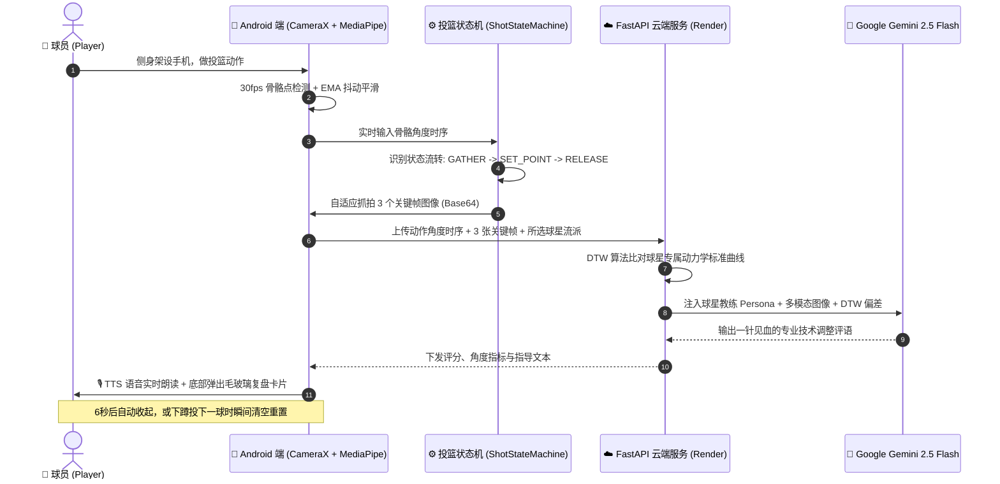

# 🏀 HoopVision (篮睛) - Next-Gen AI Basketball Shooting Coach

<div align="center">


**基于端云协同架构与 Google Gemini 多模态大模型的下一代 AI 篮球投篮动作实时诊断系统。**

[功能特性](#-核心功能与技术亮点) • [系统架构](#-端云协同架构设计) • [已完成成果](#-已完成里程碑) • [未来路线图](#-未来规划-roadmap) • [部署运行指南](#-快速启动与部署)

</div>

---

## 📖 项目简介

**HoopVision** 专为篮球爱好者与专业训练者设计。用户只需将手机架设在侧面，无需任何穿戴式传感器，系统即可：
1. 在手机端通过摄像头以 30fps+ 实时追踪全身 33 个骨骼关键点；
2. 毫秒级自适应识别投篮全生命周期（`蓄力` ➔ `举球托球` ➔ `顶峰出手`）；
3. 抓拍 3 个关键瞬间连环画，结合动态时间规整算法 (DTW) 与 **Google Gemini 2.5 Flash 多模态视觉模型** 进行专业技术诊断；
4. 通过 **原生 TTS 语音** 将教练点评实时读出，配合 **6 秒自动收起 / 下蹲秒级重置**，实现真正解放双手的“无感连续训练流”。

---

## ✨ 核心功能与技术亮点

### 1. ⚡ 3 大 NBA 经典球星流派专项诊断
* **⚡ 斯蒂芬·库里 (One-Motion 极致连贯推射)**：重点检查下蹲与向上举球的同步性、起跳未到顶点时的借力推射与出手速度。
* **🦅 科比·布莱恩特 (Two-Motion 滞空干拔跳投)**：重点检查深蹲蓄力、最高点滞空出手时机与手肘高位架起的稳定性。
* **🎯 克莱·汤普森 (教科书式 90° 几何对称)**：重点检查托球手肘标准 L 型直角与起跳中轴线的垂直平衡。

### 2. 🎙️ 彻底解放双手的智能训练闭环 (Zero-Touch Flow)
* **实时语音播报**：投篮完成瞬间，AI 教练指导语自动通过手机扬声器/蓝牙耳机朗读，无需走近看手机。
* **6 秒自动收起**：卡片弹出并播报后，启动 6 秒平滑倒计时自动隐去。
* **动作自适应秒级重置**：检测到球员再次弯曲膝盖开始下蹲 (`GATHER`) 时，卡片瞬间消失并开启下一球追踪。

### 3. 🎴 高颜值 Glassmorphism 沉浸式复盘卡片
* **顶部动态 HUD**：实时显示动作阶段与手肘/膝盖角度（最佳区间动态变绿高亮）。
* **复盘大卡片**：
  * 🏅 动作评级徽章（S / A / B / C 对应 96分 / 88分 / 76分 / 62分）。
  * 🎞️ 3 关键瞬间抓拍连环画（蓄力、举球、出手）。
  * 📐 动力学度量表与 🔊 语音重播按钮。

---

## 🏛 端云协同架构设计



---

## 🏆 已完成里程碑

- [x] **Phase 1: 实时感知与骨骼渲染** (CameraX + MediaPipe Pose + EMA 轨迹平滑)
- [x] **Phase 2: 动作切分与动力学状态机** (下蹲蓄力、举球托球、顶峰出手毫秒级切分)
- [x] **Phase 3: 动力学比对与云端基建** (FastAPI + FastDTW 时序曲线对比)
- [x] **Phase 4: 多模态大模型视觉融合** (3 关键帧端侧实时抓拍 + Gemini 2.5 Flash 视觉推理)
- [x] **Phase 5: 原生 TTS 语音教练与毛玻璃卡片** (无感语音朗读 + 高颜值 Glassmorphism 复盘 UI)
- [x] **Phase 6: 智能无感交互与 3 大球星流派** (库里/科比/汤普森专属流派 + 6s自动收起与动作重置)
- [x] **云端生产部署**: FastAPI 后端成功托管至 Render.com 免费公网平台。

---

## 🚀 未来规划 (Roadmap)

- [ ] **🏀 篮球识别与抛物线轨迹追踪 (Basketball Trajectory & Arc Tracking)**:
  - 实时检测篮球飞行轨迹，计算真实出手仰角（如 48° 黄金弧度）与最高点高度。
- [ ] **📊 训练历史记录与成长看板 (Analytics Dashboard)**:
  - 基于 Room 数据库持久化存储训练数据，统计历史投篮总数、平均分与稳定性折线图。
- [ ] **🎯 进球/打铁智能判定与命中率统计 (Make / Miss Shot Detection)**:
  - 识别篮筐位置与进球事件，将动作规范度与实际命中率进行交叉关联分析。
- [ ] **🎞️ 1.5 秒慢动作视频回放与球星左右并排对比 (Side-by-Side Video Sync)**:
  - 支持高清连贯短视频回放，与球星标准动作并排同屏播放。

---

## 💻 快速启动与部署

### 1. 后端 (FastAPI)
```bash
cd hoopvision-backend
pip install -r requirements.txt
export GEMINI_API_KEY="your_google_gemini_api_key"
uvicorn main:app --host 0.0.0.0 --port 8000
```

### 2. 客户端 (Android)
1. 使用 **Android Studio Ladybug (或更高版本)** 打开 `HoopVision` 目录。
2. 在 `com.example.hoopvision.network.ApiClient.kt` 中将 `BASE_URL` 指向您的后端公网域名。
3. 连接手机并点击 **Run** 即可编译安装。

---

## 📄 开源许可证

本项目采用 [MIT License](LICENSE) 授权。
